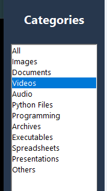

# Application Preview

The following walkthrough demonstrates how to use the **Smart File Organizer** application from launching the program to organizing files and viewing statistics.

---

## 1. Main Page

After launching the application, the main window appears. This is the central dashboard from where all file management operations are performed. Users can browse a folder, organize files, view statistics, filter categories, and monitor activities through the built-in activity log.

---

## 2. Select a Folder

Click on the **Browse File** button to choose the folder that contains the files you want to organize.

Once a folder is selected, the application scans its contents and prepares them for organization.

---

## 3. Organize Files

After selecting the folder, click **Organize Files**.

The application automatically analyzes every file and sorts it into predefined folders based on its file extension. Files are moved into appropriate categories such as:

- Images
- Documents
- Videos
- Audio
- Python Files
- Programming Files
- Archives
- Executables
- Spreadsheets
- Presentations
- Others

This eliminates manual sorting and keeps the directory clean and organized.

---

## 4. Folder Statistics

The application also provides an overview of the selected directory.

From this panel, users can quickly check:

- Total number of files
- Number of folders
- Organized files
- General information about the selected directory

This provides a quick summary before and after organization.

---

## 5. Category-wise File View

Users can filter files by category using the Categories panel.

Available categories include:

- All Files
- Images
- Documents
- Videos
- Audio
- Python Files
- Programming Files
- Archives
- Executables
- Spreadsheets
- Presentations
- Others

Selecting any category instantly displays only the files belonging to that specific type, making navigation much easier.

---

## Activity Log

The Activity Log records every operation performed by the application in real time.

It provides useful information such as:

- Folder selected
- File organization progress
- Successfully moved files
- Warnings
- Errors (if any)
- Completion status

This helps users track every action performed during the organization process and makes troubleshooting easier whenever required.
